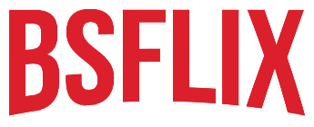

<h1 align='center'>BSFlix - #ImersaoReact</h1>

<h3>🔖 Descrição</h3>

Criação do AluraFlix, app web utilizando React na semana da #ImersãoReact da Alura.

<h3>📝 Licença</h3>

O projeto se encontra sob licença MIT. Para mais detalhes, acesse <a href='LICENSE'>license<a>.

Criado com 💙 por <a href='https://github.com/brunnosena/' target='blank'>Brunno Sena</a>
